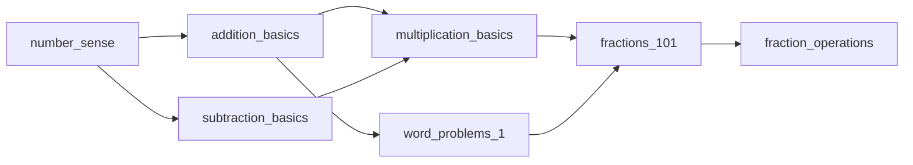

# Curriculum Dependency Graph

## Purpose

The **ConceptDependencyGraph** is an in-memory directed graph that models
prerequisite relationships between curriculum concepts. It enables:

- **Topological ordering** — determine the optimal learning sequence
- **Cycle detection** — catch circular prerequisite chains
- **Reachability queries** — check if one concept is a prerequisite of another
- **Learning path generation** — compute a study plan from any starting point
- **Dependency validation** — verify all referenced dependencies exist

It is used by the validation CLI (Story 1.3) to perform graph-level integrity
checks after the core pipeline has parsed and validated individual concept
YAML files.

## Defining Dependencies in Concept YAML

Each concept YAML file can declare its prerequisites via the `dependencies`
field, which is an array of `conceptId` strings:

```yaml
conceptId: fractions_101
learningObjective: "Understand fractions as parts of a whole"
coreIdea: "Fractions represent equal parts"
examples:
  - "One-half of a pizza"
  - "Three-quarters of a square"
misconceptions:
  - "Bigger denominator means bigger fraction"
masteryCriteria: 0.8
difficulty: intermediate
dependencies:
  - division_basics
  - number_sense
```

The `dependencies` field is optional and defaults to an empty array. A concept
with no dependencies is an **entry point** — it can be studied without any
prerequisites within the curriculum.

## Graph Operations

### Creating a Graph

```typescript
import { ConceptDependencyGraph } from '@learn-easy/db';
import type { ConceptSpec } from '@learn-easy/db';

const graph = new ConceptDependencyGraph(concepts: ConceptSpec[]);
```

The constructor accepts an array of `ConceptSpec` objects. Each concept's
`conceptId` and `dependencies` array define the graph nodes and edges.

### Query Methods

| Method | Returns | Description |
|--------|---------|-------------|
| `getDependencies(conceptId)` | `string[]` | Direct prerequisites of the given concept |
| `getDependents(conceptId)` | `string[]` | Concepts that list this concept as a prerequisite |
| `getAllConceptIds()` | `string[]` | All concept IDs in the graph |
| `isReachable(from, to)` | `boolean` | True if `to` is a transitive prerequisite of `from` |

### Graph Algorithms

| Method | Returns | Description |
|--------|---------|-------------|
| `topologicalSort()` | `string[]` | All concepts in dependency-first order (Kahn's algorithm) |
| `getLearningPath(starts)` | `string[]` | Topological order from specific starting concepts |
| `detectCycles()` | `string[][]` | All cycles found (empty array if graph is acyclic) |

#### Topological Sort (Kahn's Algorithm)

Returns concepts ordered so that every concept appears after all of its
prerequisites. Uses BFS-based Kahn's algorithm:

1. Compute in-degree (number of dependencies) for each node
2. Queue all nodes with in-degree 0 (no prerequisites)
3. Process queue: add to result, decrement in-degree of every dependent
4. Nodes whose in-degree reaches 0 are added to the queue

If the graph contains cycles, nodes in cycles (and nodes that depend on them)
will not appear in the result.

#### Cycle Detection (DFS)

Uses depth-first search with a recursion stack to identify all cycles:

1. Track visited nodes (global set) and nodes in the current recursion stack
2. If a DFS edge leads to a node already in the recursion stack, a cycle is found
3. Trace back using parent pointers to extract the cycle path
4. Cycles are de-duplicated so each cycle is reported once in canonical form
   (smallest element first)

#### Learning Path

`getLearningPath(startConceptIds)` performs a forward BFS from the given
starting concepts, following dependent edges (concepts that depend on the
start concepts), then returns those concepts in topological order.

Example:
- Graph: A → B → C (C depends on B, B depends on A)
- `getLearningPath(['A'])` → `['A', 'B', 'C']`
- `getLearningPath(['B'])` → `['B', 'C']`

## Example Dependency Relationships



In this diagram:

- **Entry points (no dependencies):** `number_sense`
- **Dependencies:** `addition_basics` depends on `number_sense`;
  `fractions_101` depends on `multiplication_basics` and `word_problems_1`
- **Learning path from `number_sense`:**
  `number_sense` → `addition_basics` / `subtraction_basics` →
  `multiplication_basics` / `word_problems_1` → `fractions_101` →
  `fraction_operations`

## Integration with CLI Validation

The validation CLI (`pnpm curriculum:validate`) runs three graph checks
after the core pipeline:

1. **Missing dependencies** (error) — every `dependencies` reference must
   point to a `conceptId` that exists in the loaded curriculum set
2. **Cycle detection** (error) — circular dependency chains are reported
   in the format `Cycle detected: A → B → C → A`
3. **Unreachable concepts** (warning) — concepts that cannot be reached
   from any entry point (concept with no dependencies) via dependent edges

## Edge Direction Convention

The graph stores edges as: **concept → its dependencies** (prerequisites).

```
getDependencies(X)   = [concepts that X depends on]
getDependents(X)     = [concepts that list X as a dependency]
isReachable(from,to) = true if `to` is a prerequisite of `from`
```

This means:
- If `B` depends on `A`, then `getDependencies(B)` returns `['A']`
- `getDependents(A)` returns `['B']`
- `isReachable('B', 'A')` returns `true` (A must be learned before B)
- `isReachable('A', 'B')` returns `false`

## Related Stories

- **Story 0.1** — ConceptSpec Schema (defines the `dependencies` field)
- **Story 0.2** — Curriculum Pipeline (parses concepts and validates)
- **Story 0.3** — Curriculum Validation CLI (runs graph checks)
- **Story 1.3** — Curriculum Dependency Graph (this module)
